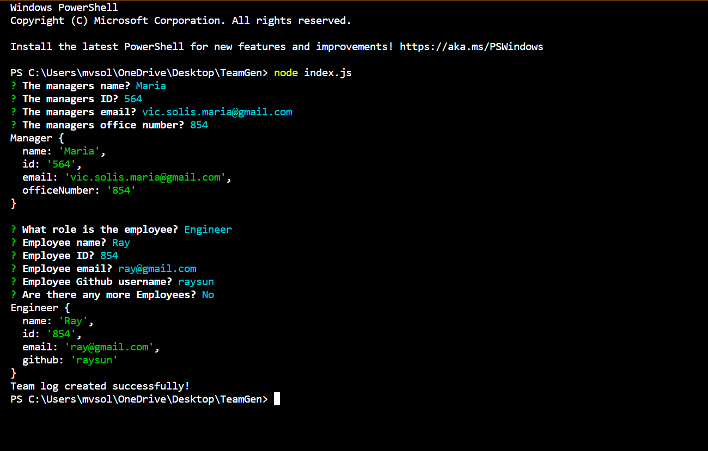
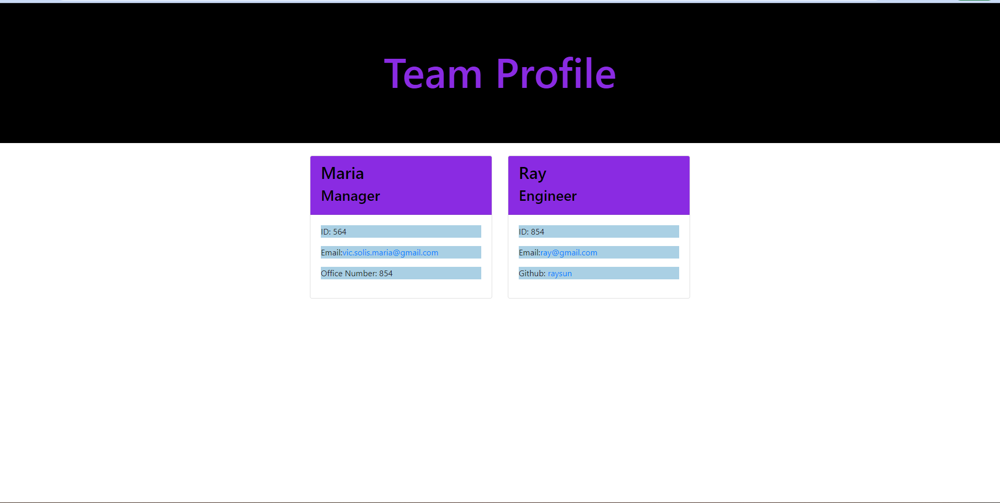

# Team Profile Generator

## Table of Contents
* [Description](#Description)
* [Usage](#Usage)
* [Test](#Test)
* [Contact](#Contact)

## Description
This profile generator for your team will help you keep track of your staff and what they do.

## Usage
In order to use it you will have to input your teams information after running node index.js. After the form is completeted, an html file will form and a website containing the information can be used. The following screenshots will indicate how.

## Test
You can run tests by using jest on the __test__ folder!
A link to the video running the [application](https://youtu.be/lmsB-_nGdE8)

## Contact
Email me at: vic.solis.maria@gmail.com
### OR
Github:marvssvil
